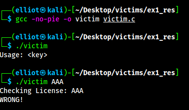
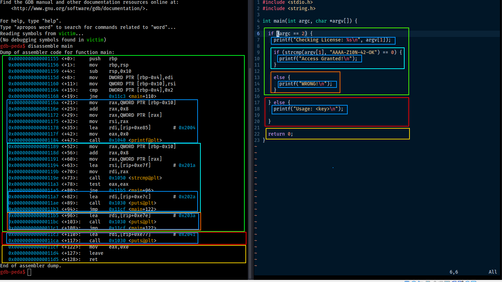
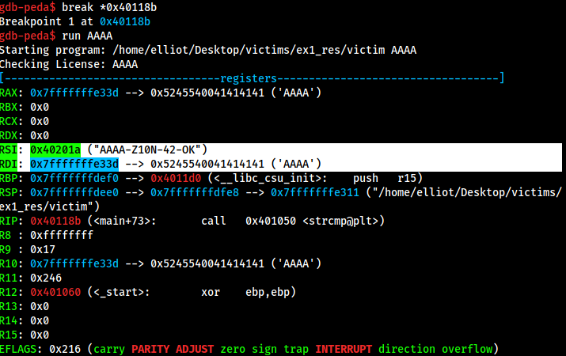

# EX 1 - Get the serial key of the program

In this simple program, you must to disassemble the program and locate the serial key. For this example, the serial key is located how a local string.

## Requirements

- GCC Installed
- GDB Installed with PEDA extension (https://github.com/longld/peda)

## Step 1 - Compile the file and test it

With GCC Installed:
gcc -no-pie victim.c -o victim

The flag -no-pie disables ASLR from compilation (For more info check: https://stackoverflow.com/questions/47778099/what-is-no-pie-used-for)

As we can observe, the program requires just one argument, but we don't know which one is the correct, that's why we are going to analyze it with GDB

## Step 2 - Main Function Analysis with GDB

With GDB installed then execute:

          gdb victim

Into gdb we are going to disassemble the main function to see it asm code:

         disassemble main

To change AT&T for intel asm sintax you must to write in gdb: `set disassembly-flavor intel` (for more info about their differences: http://staffwww.fullcoll.edu/aclifton/courses/cs241/syntax.html)

Comparing C code vs ASM code:

## Step 3 - Localize the correct string

In the C code, we can see the raw comparation between our arg input with the correct answer (AAAA-Z10N-42-OK), if we put this correct answer in the arg, the program will terminated successfully printing "Access Granted", but in the real life, we wouldn't have that, so let's try to find it in asm code.

If we see the asm code in the line [main + 73], we will see the strcmp function, but where are the arguments?

In C, the execution of the strcmp would be `strcmp(our_input, the_string_to_compare)`

In ASM, the arguments go from bottom to top, the first argument in C, would be the closest argument to the call of the function, in this case, the RDI register will be our input, and RSI register will be the string to compare, so, if we would see the RSI register before strcmp were called, in theory, we finally will see the string that it be compared.

## Step 4 - Get the correct string

So, we'll put a breakpoint on the strcmp function call and run the application

In this case, the strcmp is in 0x000000000040118b, that can be simplified in 0x40118b.

So, in gdb:

        break *0x40118b //The '*' character indicates this is a pointer to an address
        run AAAA //To execute with `AAAA` as an argument.

If you have normal GDB (without PEDA), then write `info registers` to view the current state of the registers and `x/s [string address]

## Step 5 - Test

Test it:

        ./victim AAAA-Z10N-42-OK

### Congratulations! You passed the first exercize
