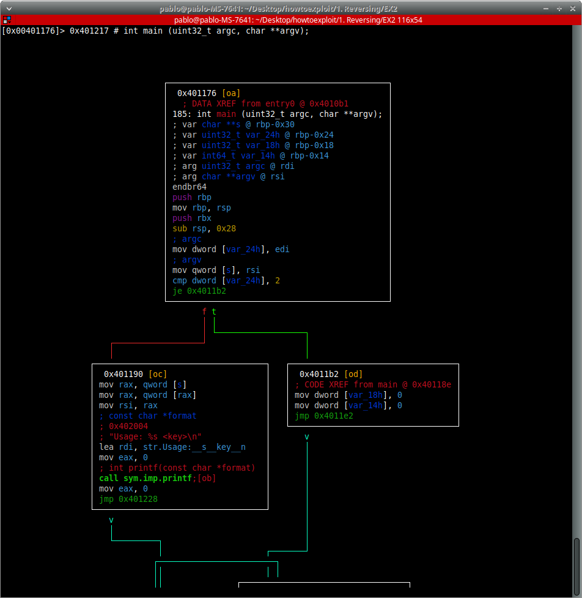
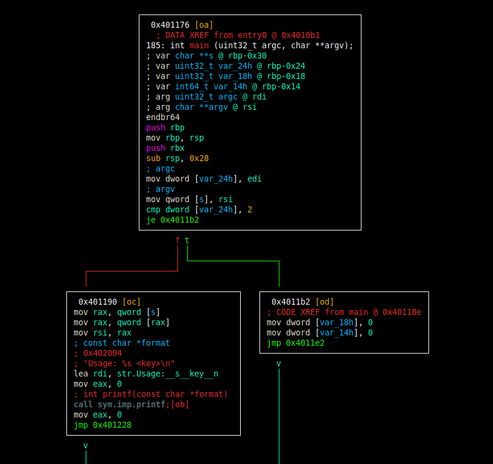
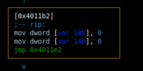
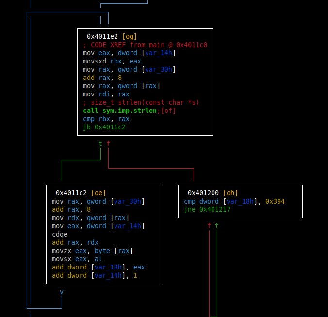
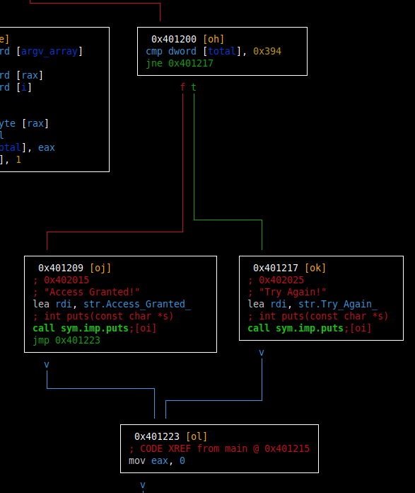

# EX 2 - Create a simple keygen

In this program, we have to debug the ASM code to know how it works and to be able to create a serial key generator.

## Requirements

- GCC installed
- Last version of Radare2 installed (Or GDB)
- Python3 installed (Or the scripting language you want)

## Step 1 - Compile the file and test it

With GCC Installed:
gcc -no-pie victim.c -o victim

And run it.

As the last exercise, the program requires just one argument, but we don't know which one is the correct, let's disassemble it and check out how to works.

## Step 2 - Main Function Analysis with Radare

With Radare2 installed execute:

          radare2 victim

In this mode, radare will proceed to statically analyze the binary, it means that radare don't will to execute it, just 'look at it from above'. If you want to analyze a malware then this is the best option to not infect your machine.

If you want to debug the binary, just execute:

          radare2 -d victim

Once radare was executed, you will see a REPL console showing the current RIP address. Type '?' to see all the commands you can use.

We let's to write:

          'aaa ; s main ; V'

- _aaa_ means that radare will analyze all the binary, searching functions, strings data, etc.
- _s main_ means that radare will search for main address and go there
- _V_ means that radare will turns into graphic mode, in this, press ':' to access to the command line and press '?' to see the commands of this. Without ':', press 'p' to change the view and 'o' to change the mode of this view. Also you can press the space bar to enter into graphic mode. In this mode, you can move with 'JKL;' (like VIM).

## Step 3 - Understanding the ASM code

### The Argc Comparison

For now we will pay atention to the basic and important things. The first thing is in the first block at bottom side, we have than _var_24h_ is argc (the number of the initial program arguments) and _s_ is the complete argv (the initial array of arguments). We can change this names with `afvn [new_value] [old_value]`, in this case:

            afvn argc_acc var_24h
            afvn argv_array s

Space twice and our variables name changed.

So, we have comparation between argc with 2, if the comparation results equal, the rip address will changeto 0x4011b2, the right block with continue of code. If, on the contrary, it does not have the same value, the rip will jump to 0x401190, the left block, printing a message and exiting.

Let's try to put a breakpoint on 0x4011b2 to see when the program jump to the right option.

For this, we have to rerun the program with -d parameter and arguments for our program:

          r2 -d victim AAA  //Without 'AAA' radare will execute our program without arguments

          //In Radare
          aaa ; s main ; V
          db 0x4011b2 //To set a breakpoint in this address
          db //To show the active breakpoints
          dc //To continue until the program arrives a breakpoint

Our checkpoint worked!

### The For Loop

Once we have passed the argc comparison, we'll see two variables initialized with 0:

Now we don't know what they are, or what are they functions, but they are important, don't forget they.

Looking fast at the loop we'll see code repeated and other stuff, let's look slowly:

In the first block we see the move of the argv_array data address to the RAX and how it is added with 8, but why?
In ASM code we don't have arrays as such, we have entires chunks of data per address direction, and we have to calculate where finish an 'array element' and where start another one, and by default, the original array address is the begining of argv[0]. This is because the compiler adds 8 bytes to the array address, to access the argv[1] element. If now we add 1, we'll go `argv[1][1]`, with adding 2, we'll go to `argv[1][2]`, etc.

Later the compiler calls strlen with the argv[1] parameter in RDI and as a result, he got in int the length of the argv[1] string and it compares with RBX, that is var_14h and execute the loop again if this variable is lower than the argv[1] length, so, we can say that var_14h is the loop variable, i will change his name to `i`.

Into the loop, we can see again our argv[1], but in this case, it is added with `i`, getting argv[1][i], saving the byte resulted in eax and adding to the other weird variable: var_18h. So we can say that what happens here is that the int value of each character of argv[1] is added to var_18h:

            ARGV[1] = 'AAA' or 65,65,65 or 0x41,0x41,0x41 in hexadecimal.
            total = 65 + 65 + 65 = 195

I will change `var_18h` name to `total`.

### Checking the result

After the for loop, we have a comparison between our `total` var with 0x394 or 916 in decimal. If our `total` is not equal, the program will print 'Try Again', but if the value is equal, it will print 'Access Granted'.

## Step 4 - Write the keygen

Write a program in the language you want, that generates a string which the add of all it characters be 916.

I writed a python script (keygen.py) that works, check it when you finish your keygen.

### Congratulations! You finish
